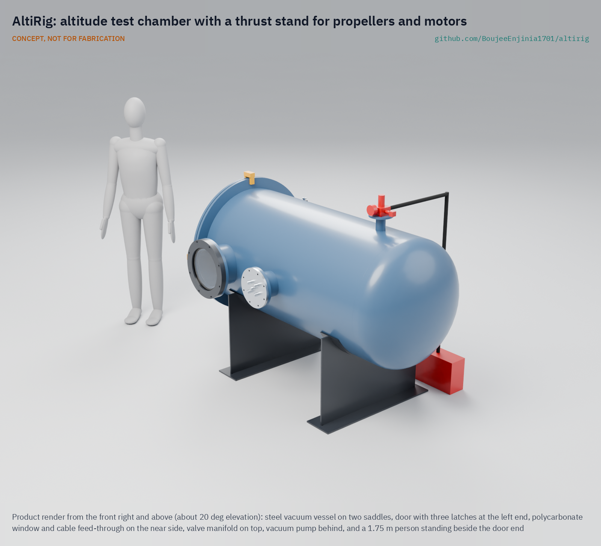
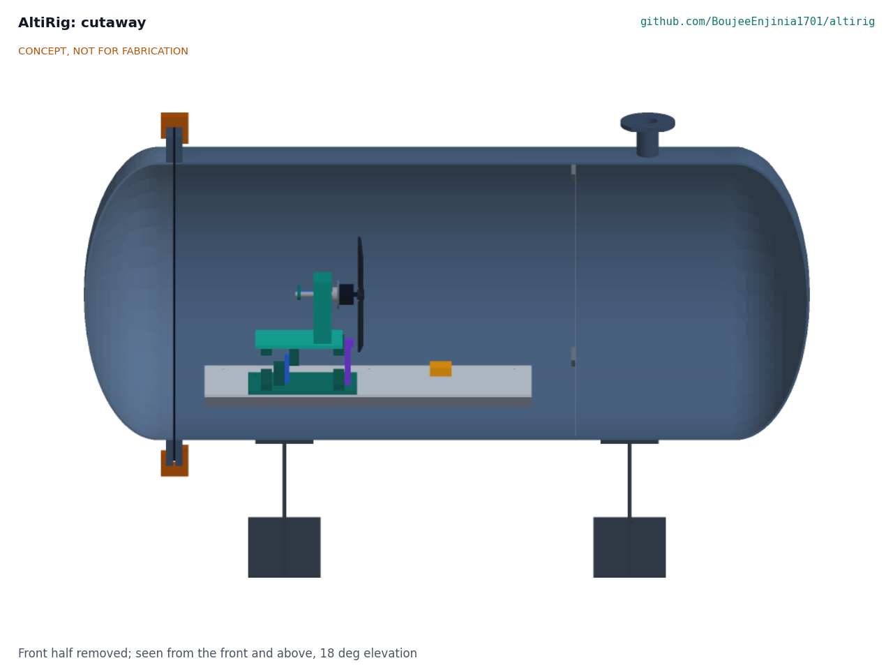
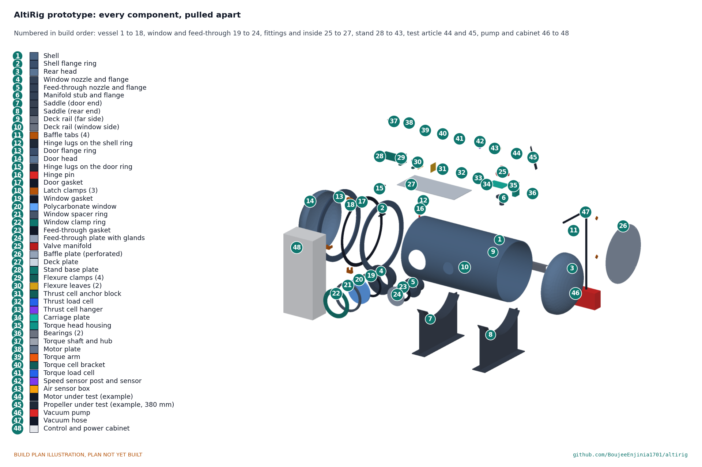

# AltiRig

   

**Area:** Aerial robotics · **TRL:** 3 of 9 (proof of concept on paper) · **Value-engineering target:** about $1,000 USD (estimated cost of the constructable design about $3,865 USD, using surplus steel and a host lab's DC supply and pump) · **Difficulty:** 3 of 5

A test chamber that simulates thin air at 5,000 m so propellers and motors can be proven before going up the mountain.

> CONCEPT, NOT FOR FABRICATION. AltiRig is a TRL 3 design on paper: it has not been built or tested.

[Exploded render](media/render-exploded.png) · [Detail render](media/render-detail.png) · [Interactive 3D model](media/viewer.html) · [Concept blueprint (PDF)](media/concept-blueprint.pdf) · [General arrangement (PDF)](cad/drawings/ALR-DWG-001.pdf) · [Calculations](docs/04-calcs/01-sizing.md) · [Prototype build plan](docs/05-build-plan.md) · [Design decisions](docs/06-design-decisions.md) · [Review note](docs/REVIEW.md)

> **Not certified pressure or test equipment.** AltiRig is a TRL 3 concept, not released for fabrication. It is a vacuum vessel with a spinning propeller inside; see [Safety](#safety).

## Concept rationale

AltiRig is the test chamber of the Kitewright civilian drone family. It is a sealed vessel with a thrust stand inside. A vacuum pump lowers the air pressure until the air density matches 5,000 m, and the stand then measures a propeller and motor's thrust, torque, speed and electrical power as they would be in the Himalaya. The same run can be repeated at any density between sea level and the target altitude.

Proving propellers and motors on the bench before carrying them up a mountain saves expeditions and aircraft. An open, documented chamber that a university lab or a welding shop and maker space can build (value-engineering target USD 1,000; the constructable design is estimated at USD 3,865 with surplus steel and a host lab's DC supply and pump) lets anyone planning high-altitude flights check their numbers first, and lets the Kitewright Lift and Range frames publish thrust data measured, not guessed. ColdCell packs are not tested inside the chamber in this version.

## Burning platform

Propeller thrust depends on air density as well as on the propeller's shape and speed ([Tyto Robotics](https://www.tytorobotics.com/blogs/articles/how-to-measure-propeller-performance-coefficients)). At 5,000 m in the standard atmosphere the density is 0.736 kg/m3, about 60% of the sea-level value of 1.225 kg/m3, and the pressure is 54 kPa ([Engineering ToolBox](https://www.engineeringtoolbox.com/standard-atmosphere-d_604.html)). A drone that hovers comfortably at the workshop can be close to its limit at a Himalayan lake. Our earlier estimate is that at 5,000 m and -20 C a multirotor hovers for only about 47% of its sea-level time (estimate).

Demand to fly this high is real. DJI ran delivery tests between 5,300 m and 6,000 m on Everest in 2024 ([DJI, 2024](https://www.dji.com/media-center/announcements/dji-completes-world-first-drone-delivery-tests-on-mount-everest-en)), and India's glacial lake work takes place above 4,500 m ([ThePrint, 2024](https://theprint.in/india/govt-approves-rs-150-crore-for-glacial-lake-outburst-flood-risk-mitigation-programme-for-4-states/2232525/)). Yet common thrust stands, such as Tyto Robotics' Flight Stand 50, measure thrust, torque and power at the conditions of the room they sit in ([Tyto Robotics](https://www.tytorobotics.com/pages/flight-stand-50)). Commercial altitude chambers exist for testing equipment at low pressure ([Sanatron](https://www.sanatron.com/articles/altitude-test-chamber-how-vacuum-chambers-simulate-high-altitudes.php)), but they are built for industry, not for a small team choosing propellers.

## Where it could be used

### By industry

| Industry | Use |
| --- | --- |
| Drone design and research | Propeller and motor selection for high-altitude multirotors and quadplanes |
| Mountain rescue and disaster agencies | Checking that a drone will hover with margin at the altitude of a call-out before deployment |
| Universities and technical colleges | Teaching lab for propeller aerodynamics and the effect of air density |
| Glaciology and survey | Verifying survey drones before summer campaigns above 4,500 m |
| Battery and electronics testing | Low-pressure checks of battery packs, connectors and electronics for arcing or seal problems |

### By country or region

| Country or region | Why it matters there |
| --- | --- |
| Nepal | Drone delivery tests on Everest ran between 5,300 m and 6,000 m in 2024 ([DJI, 2024](https://www.dji.com/media-center/announcements/dji-completes-world-first-drone-delivery-tests-on-mount-everest-en)). |
| India (Himalaya) | Survey and mitigation work on 189 high-risk glacial lakes takes place above 4,500 m ([ThePrint, 2024](https://theprint.in/india/govt-approves-rs-150-crore-for-glacial-lake-outburst-flood-risk-mitigation-programme-for-4-states/2232525/)). |
| India (Ladakh) | The Gya glacier snout that fed the 2014 outburst flood lies at about 5,450 m ([Science of the Total Environment](https://www.sciencedirect.com/science/article/abs/pii/S0048969720375392)). |
| Pakistan (Karakoram) | The 2018 Broad Peak search found Rick Allen by drone at about 7,500 m ([Explorersweb, 2018](https://explorersweb.com/rick-allen-found-alive-on-broad-peak/)). |

## What sparked the idea

In July 2018 a small consumer drone found the climber Rick Allen alive at about 7,500 m on Broad Peak, 36 hours after he fell from an ice cliff ([Explorersweb, 2018](https://explorersweb.com/rick-allen-found-alive-on-broad-peak/)). That the drone flew at all in air that thin was notable. For the Kitewright family to fly reliably at 5,000 m and above, its propellers and motors need to be tested in that air before they go up, and AltiRig is the bench that makes that possible at sea level.

## Problem

Propellers and motors make much less thrust in the thin air of the high Himalaya, but most makers can only test them at the altitude of their workshop. They find out what works at 5,000 m by flying there, which is slow, costly and risky.

Full problem statement: [docs/01-problem.md](docs/01-problem.md)

## Concept

A sealed test chamber with a thrust stand that pulls the air down to the density of 5,000 m altitude, so makers measure propeller and motor thrust and power as they will be in the Himalaya.

The constructable design is a horizontal steel vessel made from a surplus 813 mm (32 in) pipe offcut and two surplus tank heads, one of them the door, on two saddles. Inside, a flexure thrust stand measures thrust from 0 to 50 N and torque to 2 N m on propellers up to 380 mm. The density of 5,000 m (0.736 kg/m3) is reached at about 61.9 kPa at room temperature in about 3 minutes. The vessel is designed for full vacuum with a collapse factor of 6.7. On paper all twelve requirements are met: an 80 % open baffle keeps the chamber effect (R6) to an estimated 1.8 % to 3.3 %, and the cost (R10), restated by Amish to USD 4,000, is estimated at USD 3,865 (see the [review note](docs/REVIEW.md)).

Full design precis: [docs/02-concept.md](docs/02-concept.md) · Requirements: [docs/03-requirements.md](docs/03-requirements.md)

## Key components

- Pressure vessel: 813 x 6.35 mm steel pipe shell, 2:1 ellipsoidal tank heads, flange rings and a sponge-gasket door held shut by air
- Viewing port: 20 mm polycarbonate window, outside the propeller's fragment zone
- Vacuum pump (the host lab's, 170 L/min), relief valve, normally-open bleed valve and gauge on one manifold
- Thrust and torque stand: spring-steel flexures, 10 kg thrust cell, torque head on bearings with a 5 kg cell
- Speed sensor: optical, one pulse a turn
- Pressure, temperature and humidity sensors on the deck
- Sealed feed-through plate with potted IP68 cable glands
- Removable 80 % open perforated baffle
- Control cabinet: logger, contactor for the host lab's 1,500 W motor supply, emergency stop, door interlock and arming key

## Building the prototype

The [prototype build plan](docs/05-build-plan.md) shows how to make each of the twenty-two made parts, with a making sketch for each, ten joint close-ups and twenty assembly steps. The vessel is cut and welded by a welding shop from surplus pipe, plate and two surplus tank heads; the stand is cut, drilled and bored from aluminium and spring-steel shim. Before any pump-down a qualified engineer reviews the vessel calculation, and the first pump-down is a proof test behind a guard. The plan is a plan, not yet built.

## Safety

> Published as an open engineering reference, not certified pressure or test equipment.
>
> The chamber is a vacuum vessel: at the 5,000 m density point the outside air pushes on it with about 39 kPa, and with up to 55 kPa at the relief setting, roughly 4 to 5.6 tonnes-force per square metre of wall. Collapse or window failure can throw fragments. The vessel is designed for full vacuum with a collapse factor of 6.7, a relief valve stops the chamber at 46.3 kPa absolute, the window is polycarbonate (never acrylic or glass), and the first pump-down is a proof test behind a guard after a qualified engineer has reviewed the calculation.
>
> The door is held shut by up to 24 kN under vacuum. Vent the chamber before unlatching it; never force it.
>
> Spinning propellers can shatter. The window and feed-through sit outside the propeller's fragment zone, the steel shell contains a broken blade, and the motor can only be armed with the door latched and the key turned.
>
> No lithium or sodium-ion pack goes inside the chamber in this version: a fire in a closed vessel is a pressure and fume hazard.
>
> The pump and motor supply run from mains through a 30 mA residual current device with the vessel earthed; the emergency stop removes motor and pump power and the bleed valve opens on loss of power.
>
> This design is published as an open engineering reference. It is not certified equipment.

## Repository layout

| Folder | Contents |
| --- | --- |
| `docs/` | Problem, concept, requirements, calculations and design decisions |
| `cad/src/` | build123d Python source, the source of truth for all geometry |
| `cad/step/`, `cad/stl/` | Exported models for FreeCAD, other CAD tools and printing |
| `cad/drawings/` | 2D sketches and dimensioned drawings |
| `bom/` | Bill of materials |
| `electronics/` | KiCad schematics and PCB layouts |
| `firmware/` | Microcontroller code |
| `media/` | Renders, perspectives and photos |
| `build-log/` | Dated prototyping notes |

## Documentation

Controlled documents follow the portfolio [documentation standard](.kit/STANDARDS.md). Each carries a document ID (ALR-PRC-001 for the precis), a version and a revision history. Branded PDFs are built with `python .kit/render.py` and attached to GitHub Releases when a document is tagged, for example `ALR-PRC-001/v1.0`.

## Credits

Designed by Amish Chadha at Design Molecule Labs. See [CONTRIBUTORS.md](CONTRIBUTORS.md) for roles. To cite this design, use [CITATION.cff](CITATION.cff) (GitHub shows it as "Cite this repository").

AI assistance (Claude) was used to accelerate prototype documentation and first-pass research. Design direction and all decisions are Amish Chadha's, recorded in this repository's decision records (`docs/decisions/`).

## Licenses

- **Hardware** (CAD, drawings, BOM, electronics): [CERN-OHL-S v2](LICENSE)
- **Software** (firmware, scripts, notebooks): [MIT](LICENSE-SOFTWARE)

A project of the [Design Molecule](https://designmolecule.com) lab.
