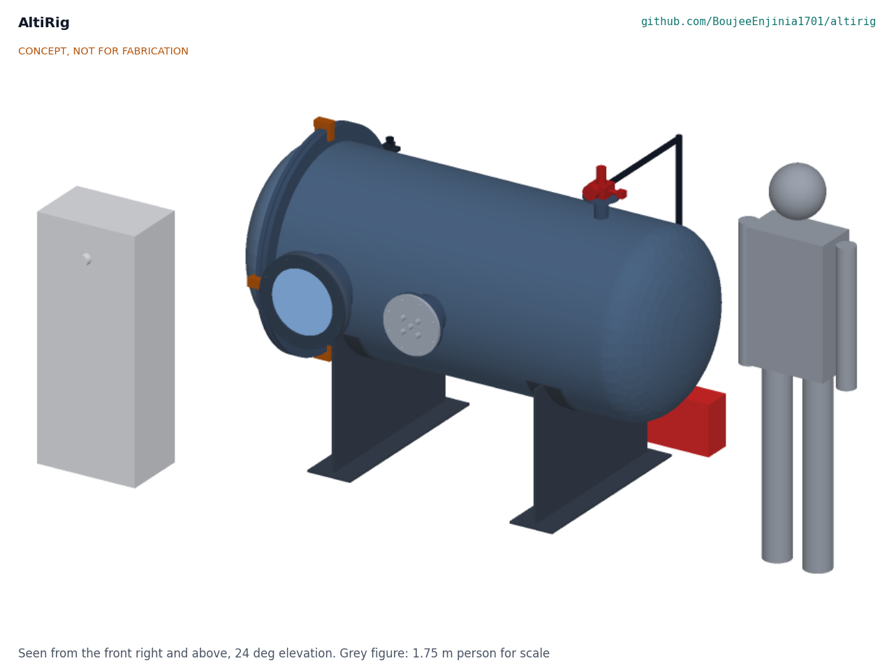
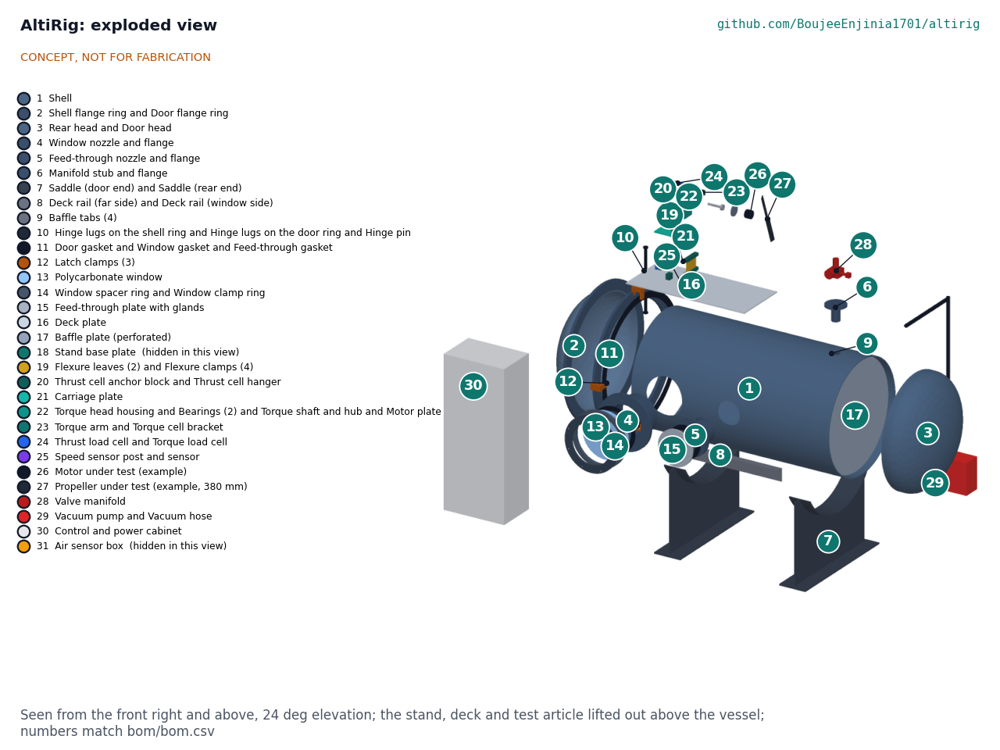
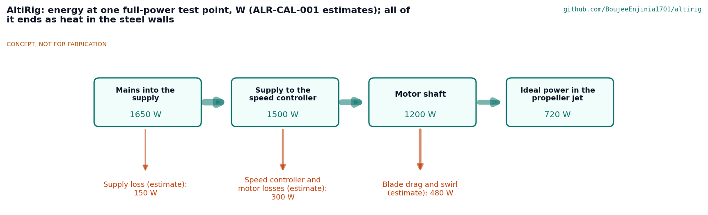

# AltiRig design precis

A test chamber that simulates thin air at 5,000 m so propellers and motors can be proven before going up the mountain.

AltiRig is a horizontal steel vacuum vessel, 813 mm in diameter and about 2 m long, with a flexure thrust stand inside. A vacuum pump lowers the pressure until the air inside has the density of 5,000 m (0.736 kg/m3, about 61.9 kPa at 20 °C), and the stand measures a propeller's thrust, torque and speed with the motor's voltage and current. The vessel is built from a steel pipe offcut and two bought tank heads, one of which is the door; air pressure holds the door shut while the chamber is under vacuum.

*Figure 1. AltiRig, seen from the front right and above: vessel on two saddles, door and latches at the left end, window and feed-through on the near side, valve manifold on top, pump behind, control cabinet in front.*

## How it works

The motor and propeller under test sit on the axis of the vessel, 510 mm in from the door, blowing toward the rear head. The operator closes the door, latches it and starts the pump. The controller reads two pressure sensors and two temperature probes inside, works out the air density, and holds it at the chosen value by switching the pump and opening a bleed valve that lets room air back in. As the motor runs, its heat warms the air; the controller raises the pressure a little to keep the density steady.

The propeller's thrust moves the carriage of the stand by about a tenth of a millimetre on two spring-steel leaves, and a load cell between the carriage and the base measures it. The motor is mounted on a shaft that turns freely in two bearings; its reaction torque presses an arm onto a second load cell. An optical sensor counts the blades. Motor power comes from a 1,500 W supply in the control cabinet through a speed controller and a sealed feed-through plate. Everything is logged to CSV at 20 Hz.

Inside a closed vessel the propeller drives a loop of air: down the middle, through a perforated baffle, round the rear head and back along the wall. To find what the loop does to the readings, each propeller is also run at ambient pressure and compared with an open-air stand; that comparison is published with the data.

*Figure 2. Cutaway with the window side removed: stand and motor on the deck at the door end, the propeller plane, the baffle and the rear head.*

## Components

*Table 1. Main components (numbers match `bom/bom.csv`).*

| # | Component | Role |
| --- | --- | --- |
| 1 | Shell | 813 x 6.35 mm steel pipe offcut, 1,500 mm long; the body of the vessel |
| 2 | Flange rings | 20 mm steel rings on the shell end and on the door; the door seals on a sponge gasket between them |
| 3 | Dished heads | Two bought 2:1 ellipsoidal heads: one welded to the rear, one is the door |
| 4 | Window nozzle and flange | 10 in heavy-wall stub with a flange for the window |
| 5 | Feed-through nozzle and flange | 6 in heavy-wall stub with a flange for the cable plate |
| 6 | Manifold stub | 2 in stub on top for the valve manifold |
| 7 | Saddles | Two welded steel saddles carrying the vessel at axis height 800 mm |
| 8, 9 | Deck rails and baffle tabs | Welded inside to carry the deck and the baffle |
| 10 | Hinge | Lugs and a 20 mm pin; the door swings to the far side |
| 11, 12 | Gaskets and latch clamps | EPDM gaskets; three latches pull the door on for the first seal |
| 13, 14 | Window, spacer and clamp rings | 20 mm polycarbonate window, 340 mm, clamped on its flange |
| 15 | Feed-through plate | Aluminium plate with five potted IP68 cable glands |
| 16, 17 | Deck plate and baffle plate | Aluminium deck for the stand; 63 % open perforated baffle, removable |
| 18 to 25 | Thrust stand | Base, two flexure leaves and clamps, carriage, thrust cell, torque head on bearings, torque arm and cell, speed sensor |
| 26, 27 | Motor and propeller under test | Example 6S motor and 15 x 5 in propeller; users bring their own |
| 28 | Valve manifold | Relief valve (opens 55 kPa below atmosphere), gauge, normally-open bleed valve, vent and isolation valves |
| 29 | Vacuum pump and hose | 170 L/min single-stage rotary vane pump |
| 30 to 35 | Cabinet, sensors, supply, speed controller, controller, safety controls | Mains protection, 1,500 W motor supply, logger, emergency stop, door interlock and arming key |

*Figure 3. Exploded view; numbers match the bill of materials.*

## Key design choices

All were decided on 2026-10-03 under Amish's pre-approval and are argued in ALR-DDR-001 (TRL 2 review) and ALR-DDR-002 (design for construction).

- **Match density, not pressure.** Thrust and power depend on density. At room temperature the density of 5,000 m is reached at 61.9 kPa, not at the 54.0 kPa of the real atmosphere there. Pressure and temperature are logged so either can be reported.
- **A pipe vessel with tank heads, designed for full vacuum.** Thin drums collapse and flat panels need heavy ribs. A 6.35 mm pipe with dished heads has a collapse factor of 6.7 even at full vacuum, so a stuck relief valve cannot collapse it.
- **The door is a tank head held shut by the air.** At the 5,000 m point the air presses the door shut with 24 kN, so it cannot be opened until the chamber is vented.
- **A flexure stand, not rails.** Two spring-steel leaves carry the carriage with no sliding friction; the small share of thrust they carry is calibrated out.
- **Window and feed-through outside the propeller's fragment zone.** Both sit more than 18° from the propeller plane; the steel shell contains a broken blade.
- **No batteries inside the chamber in the first version.** The motor is powered from outside through the feed-through, so a battery fire cannot happen inside a closed vessel.

## First-order numbers

From ALR-CAL-001; assumptions are stated there.

*Table 2. First-order numbers.*

| Quantity | Value |
| --- | --- |
| Density range | Ambient down to 0.660 kg/m3 (6,000 m) at up to 30 °C; relief at 46.3 kPa |
| Free volume | 0.93 m3 |
| Pump-down to 54 kPa | 4.0 min |
| Shell collapse factor at full vacuum | 6.7 (heads 40, window 7.1 on yield) |
| Door force at the 5,000 m point | 24 kN |
| Thrust range and error | 0 to 50 N, 0.13 N (0.27 % of full scale) |
| Torque and speed error | 0.28 % of 2 N m; 0.02 % |
| Density error | 0.6 % |
| Chamber effect (estimate) | 2.9 % to 5.3 % more thrust than open air with the baffle |
| Mass | About 470 kg vessel, about 590 kg with pump and cabinet |
| Cost | Value-engineering target: USD 1,000. Estimated cost of the constructable design: USD 4,920 (USD 3,920 over the target) |

*Figure 4. Energy at one full-power test point; every watt ends as heat in the steel walls.*

## Patent design-arounds

From the preliminary patent, trademark and prior-art screen (not legal advice):

- None identified in the preliminary screen.

## Shared blocks

- Kitewright Lift and Kitewright Range (propulsion under test; they publish their propulsion kits using AltiRig data)
- ColdCell (packs are not tested inside the chamber in the first version; see Safety)
- CalRig proof-load method for calibrating the load cells, if adopted

## Safety

> **Safety:** AltiRig is a vacuum vessel with a spinning propeller inside, run from mains power.
>
> - **Vacuum (pressure) hazard.** At the 5,000 m point the air outside pushes on the vessel with 39 kPa, about 4 tonnes-force on each square metre. Collapse or a failed window can throw fragments. The vessel is designed for full vacuum with a collapse factor of 6.7, the relief valve stops the chamber below 46.3 kPa, and the first pump-down is a proof test behind a guard with nobody in line with the window. Only polycarbonate is used for the window; acrylic and glass shatter.
> - **Door.** The door weighs about 72 kg and is held shut by up to 24 kN. Never force it: vent first through the bleed or vent valve, then unlatch.
> - **Spinning propeller.** A propeller can break at speed; fragments fly in its own plane. The window and feed-through are outside that zone, the steel shell contains it, and the motor can only be armed with the door latched and the key turned.
> - **Batteries.** No lithium or sodium-ion pack goes inside the chamber in this version. A battery fire in a closed vessel raises the pressure and the fumes are toxic; battery tests need a vent and fire plan that is not part of this design.
> - **Mains.** The pump and the motor supply run from mains through a 30 mA residual current device with the vessel earthed. The emergency stop removes motor and pump power, and the bleed valve opens when power is lost.
> - **Noise and oil mist.** The pump exhausts oil mist; lead the exhaust outdoors. Wear hearing protection near the running propeller.
>
> AltiRig is published as an open engineering reference. It is not certified pressure equipment or test equipment.

## Open questions

None are open in the design. Decisions still to be made are kept in the design decisions register (`docs/06-design-decisions.md`), and items to confirm when parts are bought are listed there.
